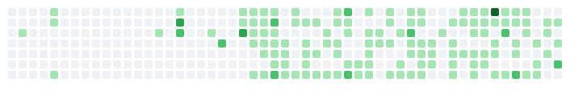

<a href="https://github.com/razoring">
  <picture>
    <source media="(prefers-color-scheme: dark)" srcset="dark.svg">
    
  </picture>
</a>

<!-- GITHUB_STATS_START -->

  
GitHub Stats

  ### Languages
  

  

  ### Frameworks
  

  

  ### Profile Views
  

  

  ### Tools
  

 

  

<!-- GITHUB_STATS_END -->